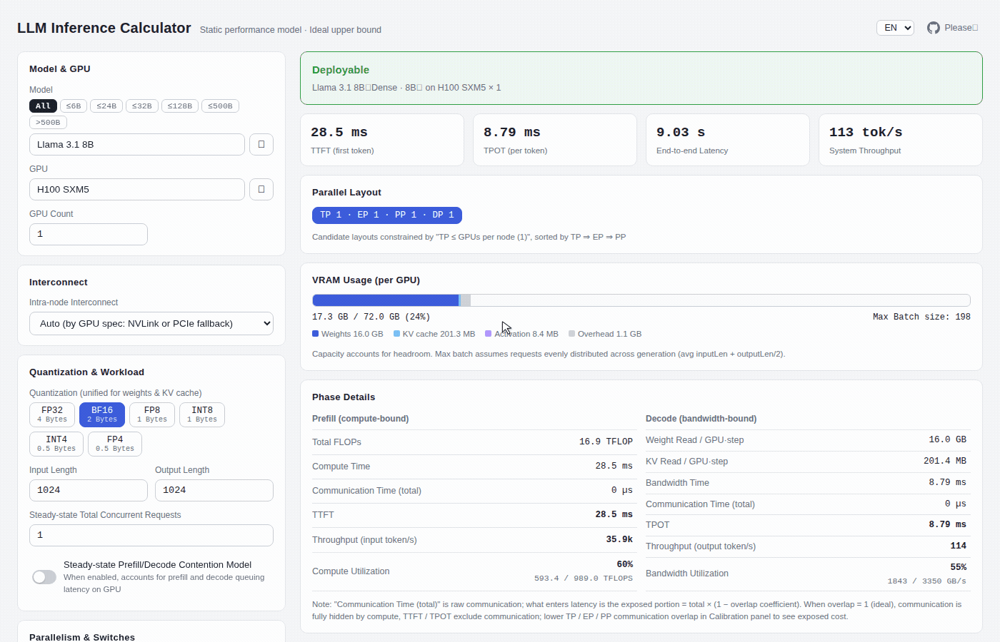

# LLM Inference Performance Modeling: Deriving TTFT / TPOT / Throughput from First Principles, with Web Calculator

> [中文版](./modeling_zh.md)

## Motivation

When deploying LLMs locally or doing LLM capacity planning at a company, two questions are unavoidable:

1. **Is there enough VRAM**: which GPU, how many cards, what batch size can fit, and how to choose the parallelism strategy?
2. **If yes, what are the latency and throughput**: Time To First Token (TTFT, latency to the first token), Time Per Output Token (TPOT, time per output token, equivalent to Inter-Token Latency / ITL), end-to-end latency, and system throughput.

The problem is that latency and throughput involve too many variables — batch size, input length, output length, the ratio of prefill to decode, and other parameters are all dynamic. The cross-interactions between different parallelism strategies are even more tangled. Existing estimation tools (such as [vram-calculator](https://apxml.com/tools/vram-calculator), [tps](https://tps.bunai.cc/), etc.) either support too narrow a parameter range or introduce too many complex assumptions, making their rough estimates insufficiently accurate and hard to validate.

So we take a different approach: **use the simplest possible assumptions to compute the static ideal inference performance of LLMs — given a model and hardware configuration, quickly derive theoretical upper bounds for throughput and latency**. We also provide a web-based calculator so you can try it hands-on.

> Readers who are not interested in the computation details can jump straight to the [web calculator](https://llm-inference-calculator-delta.vercel.app/) to get a feel for it.  If you find it useful, please ⭐ the [github repo](https://github.com/pochenai/llm-inference-calculator)!


## Terminology

The following sections use various symbols and abbreviations. They are collected here for easy reference. You may also skip directly to the [next section](#1-simplifying-assumptions).

**Workload and Model Specifications**

| Symbol | Meaning |
|---|---|
| `B` | batch size (number of requests processed concurrently) |
| `N_in` / `N_out` | input / output sequence length (number of tokens) |
| `S` | sequence length (including historical tokens); during decode, `S = N_in + number of generated tokens` |
| `h` | hidden size (width of the residual stream) |
| `L` | number of model layers |
| `P_total` / `P_active` | total parameter count / active parameters per token (equal for dense models; `P_active < P_total` for MoE models) |
| `q_heads` / `kv_heads` | number of query attention heads / KV attention heads (`kv_heads < q_heads` in GQA) |
| `head_dim` | dimension per head |
| `qDim` | query projection dimension `= q_heads × head_dim`. In standard MHA, `qDim = h`; in MLA, it may be `< h` |
| `r` / `prefillRatio` | fraction of requests that are prefill (0~1); used in non-PD mode to estimate GPU time allocation between the two phases |
| `ρ_prefill` / `ρ_decode` | fraction of GPU time spent in prefill / decode respectively (derived from `r` and each phase's throughput rate; `ρ_prefill + ρ_decode = 1`) |

**Parallelism Dimensions** (`TP × EP × PP × DP = N_gpu`)

| Symbol | Meaning |
|---|---|
| `t` / `TP` | Tensor Parallelism size — intra-layer weight sharding, intra-node only |
| `p` / `PP` | Pipeline Parallelism size — layer-wise partitioning, can span nodes |
| `e` / `EP` | Expert Parallelism size — expert dispatching, MoE models only |
| `d` / `DP` | Data Parallelism size — full model replication, no weight sharding |
| `N_gpu` | total number of GPUs |
| `gpusPerNode` | GPUs per node (typically 8, e.g., NVIDIA HGX baseboard) |

**Precision and Byte Counts**

| Symbol | Meaning |
|---|---|
| `b_w` | bytes per parameter for weights, determined by quantization precision (FP16=2, FP8=1, FP4=0.5) |
| `b_kv` | bytes per element for KV cache, determined by KV cache precision, independent of `b_w` (e.g., INT4 weights + FP8 KV) |
| `b_act` | bytes for activation / communication message precision, typically bf16=2, independent of weight quantization precision |

**Communication**

| Symbol | Meaning |
|---|---|
| `BW` | link bandwidth (separate values for intra-node / inter-node) |
| `α` | fixed total latency per collective call (see Assumption 7) |
| `*CommOverlap` | compute-communication overlap coefficient for each parallelism dimension (1 = fully hidden, 0 = fully exposed) |

**MoE**

| Symbol | Meaning |
|---|---|
| `E` / `experts` | total number of experts |
| `k` / `expertsPerToken` | number of experts routed to per token (top-k) |
| `coverage` | expert coverage within a batch: `1 - (1 - k/E)^B` |

**Latency Metrics**

| Abbreviation | Full Name / Meaning |
|---|---|
| TTFT | Time To First Token, latency to the first token (= total prefill time) |
| TPOT | Time Per Output Token, time per output token |
| ITL | Inter-Token Latency, latency between tokens (equivalent to TPOT) |
| E2E | End-to-End latency |
| MFU | Model FLOPs Utilization |

**Architecture Abbreviations**

| Abbreviation | Full Name |
|---|---|
| MHA | Multi-Head Attention |
| GQA | Grouped Query Attention |
| MLA | Multi-head Latent Attention |
| SSM | State Space Model |
| MoE | Mixture of Experts |
| PD Disaggregation | Prefill-Decode Disaggregation (two phases deployed on separate GPU pools) |

**Attention Computation**

| Term | Meaning |
|---|---|
| QK^T | Query-Key dot product — computes the attention score matrix (`Q × K^T`), FLOPs = `2 * N² * qDim` |
| AV | Attention-Value weighted sum — weights Value by attention scores (`Attn × V`), FLOPs also `2 * N² * qDim` |
| QK^T + AV | total of the attention quadratic term, `4 * N² * qDim` FLOPs per layer |

**Derived Constants and Intermediate Performance Quantities**

| Symbol | Meaning |
|---|---|
| `W_bytes` | total bytes of model weights `= P_total × b_w` |
| `flops_per_token` | linear-term FLOPs per token `≈ 2 × P_active` (excluding the attention quadratic term) |
| `kv_per_token` | KV cache bytes per token (see §3 for the formula) |
| `Peak_FLOPs` | per-GPU peak compute (FLOPS), depends on the data type column corresponding to quantization precision |
| `T_compute` | pure prefill compute time `= FLOPs_prefill / (N_gpu × Peak_FLOPs × MFU)` |
| `T_comm` | prefill / decode communication time (sum of TP all-reduce + EP all-to-all + PP P2P) |
| `T_step` | time for one decode step (= TPOT = ITL) |
| `T_tp_comm` | communication time for TP all-reduce within one decode step |
| `S_history` | number of history tokens generated so far during decode (`S = N_in + number generated`) |
| `BW_eff` | per-GPU effective memory bandwidth `= bwGbps × bwEffDecode` (bytes/s) |
| `bwGbps` | GPU raw HBM bandwidth (GB/s, hardware specification) |
| `bwEffDecode` | memory bandwidth utilization calibration parameter for the decode phase (0~1; IDEAL mode uses 1) |
| `W_read_per_step` | weight bytes to read per decode step (dense = `W_bytes`; for MoE, depends on expert coverage) |


## 1. Simplifying Assumptions

The goal of performance estimation is only a rough upper-bound reference, so this project simplifies real-system complexity as much as possible, keeping only the factors that have the greatest impact on latency and throughput:

1. **No modeling of Continuous Batching or Paged Attention**: we assume one batch of inputs is sent in all at once and computed to completion; sequence lengths are uniform, with no dynamic request arrivals/departures and no padding overhead. These two engineering optimizations primarily address memory fragmentation and dynamic sequence lengths; under the uniform batch assumption, they do not affect throughput conclusions.
2. **Single quantization precision**: all model weights are quantized to the same precision (one of FP4 / FP8 / FP16 / FP32), described by a single bytes-per-parameter value.
3. **Workload execution model**: the workload uses a simplified model supporting two prefill/decode coexistence modes:
   - **Non-PD (Colocated)**: prefill and decode share the same set of GPUs, time-sharing based on the prefill request ratio `r` (`prefillRatio`). Resource contention between the two phases is estimated using a probabilistic model: prefill and decode each occupy a GPU-time fraction `ρ_prefill` and `ρ_decode`; TTFT and TPOT each add an expected wait from the other phase (when randomly landing in the other phase, average wait = other phase duration / 2).
   - **PD Disaggregated**: prefill and decode are deployed on separate GPU pools; the two phases do not contend for resources. TTFT = prefill compute time + the exposed portion of KV cache cross-pool transfer (`kvTransferOverlap` controls the overlap ratio); TPOT is unaffected by prefill.

   Therefore, this model only evaluates from a **single-request perspective**: in IDEAL mode, TTFT is determined solely by the total number of GPUs (total FLOPs ÷ total compute), independent of the layout; in calibrated mode, cross-node PP affects TTFT through exposed communication time (bandwidth term × `(1 - ppCommOverlap)` + α), but this remains a simplified assumption — it does not account for overlap differences caused by non-uniform inputs (varying input/output lengths within a batch). In real serving systems, the throughput and tail-latency (P99) benefits of PP + Chunked Prefill come from the continuous batching scheduling layer (mixing long and short requests, eliminating head-of-line blocking). Multi-turn conversation scenarios are not covered by this assumption.
4. **Multi-node results are not intended to be precise**: single-node is strictly calibrated; multi-node adds only a low-order correction factor.
5. **Pipeline bubble is not modeled**: real schedulers use finer microbatch splitting, interleaved execution, chunked prefill, and other techniques to greatly compress pipeline fill/drain emptiness. A pessimistic estimate like `(B+pp-1)/B` would significantly overestimate actual overhead. The IDEAL model assumes bubble ≈ 0, counting only inter-stage P2P activation transfers in TTFT (see the generic communication cost model).
6. **Activation memory is roughly estimated**: with FlashAttention enabled, activations are approximated as a single `O(N×h)` residual buffer; with FlashAttention disabled, the `N²` attention score matrix is added (the real OOM cliff). We do not precisely model the number of buffers and fragmentation — relative to weights + KV, activations are a small term; and unlike "scheduling inefficiency," activations represent real physical occupancy, so the ideal model keeps their lower bound rather than zeroing them out.
7. **Semantics and values of α (small-message collective communication latency)**: α is the **fixed total latency per collective call** — all rounds and all hops within a single all-reduce are included; it is not per-hop. The hop-dependent data volume is handled by the bandwidth term `2(t-1)/t`. IDEAL mode uses α=0, outputting a strict pure-bandwidth upper bound; practical calibrated values are ≈ 0.01 ms intra-node / ≈ 0.03 ms cross-node, consistent with measured NCCL small-message all-reduce totals of 6–11 μs (we do not adopt the overestimated per-hop × hop-count approach). α takes effect only when the corresponding `*CommOverlap < 1` (collective communication in small-batch decode cannot be overlapped). We do not reverse-engineer α from batch=1 inference latency (which mixes in small GEMM kernel latency and would overestimate by an order of magnitude).


## 2. Modeling Framework: Two Phases (PD) + Four Resource Axes

Despite the extensive simplifications, LLM inference still involves many variables: different attention architectures, KV cache computation methods, cross-interactions of DP/TP/PP/EP/PD disaggregation parallelism strategies, the role of FlashAttention, workload modeling for input/output lengths and prefill/decode ratios...

How do we organize all these factors into a unified framework?

The core idea is actually simple. We are building a **static model** — assuming the system is already in steady state, we only need to compute how the current batch's inputs and outputs affect KV cache / throughput / latency; the next batch will automatically refresh the KV cache, and each batch's memory footprint is the same. This greatly simplifies the entire modeling process.

Specifically, the data flow of LLM inference can be divided into **two phases — prefill and decode** — whose performance bottlenecks are entirely different:

| Phase | Bottleneck Axis | Physical Reason | Main Time Formula |
|---|---|---|---|
| **Prefill** (determines TTFT) | Compute-bound | Weights are read only once, amortized over `B × N_in` tokens, yielding high arithmetic intensity | `T_prefill ≈ FLOPs / (MFU × Peak_FLOPs)` |
| **Decode** (determines TPOT / ITL) | Memory bandwidth-bound | Each generated token requires re-reading all weights + all historical KV cache; arithmetic intensity ≈ 2 FLOP/byte | `T_step ≈ (W_bytes + KV_read_bytes) / BW_eff` |

At the system level, we only need to focus on **four resource axes**:

1. **Memory capacity** — determines "whether it can run" (VRAM check)
2. **Memory bandwidth** — determines how fast decode is
3. **Compute FLOPs** — determines how fast prefill is
4. **Communication bandwidth** — the fourth axis introduced by parallelism, affecting latency

Combining these four axes with the two phases, the entire modeling flow becomes clear:

```
(model, quant)      --> three derived constants: W_bytes, kv_per_token, flops_per_token
(hardware, layout)  --> per-GPU capacity / bandwidth / communication cost
(B, N_in, N_out)    --> workload
        |
        v
  [1] VRAM check (capacity axis) --fails--> report OOM + back-solve B_max
        | passes
        v
  [2] Prefill (compute axis + communication)  --> TTFT
  [3] Decode    (bandwidth axis + communication)  --> TPOT = ITL
        |
        v
  [4] E2E = TTFT + N_out * TPOT
      throughput = B * N_out / E2E
```

### From Model Specifications to Three Derived Constants

Regardless of the model — Dense or Mixture of Experts (MoE), standard attention or Multi-head Latent Attention (MLA) — the first step is to compress the model specifications into **three derived constants**. All subsequent computation is built on these three numbers:

```
W_bytes         = P_total * b_w
                  └──┬──┘   └┬┘
                     │       └ bytes per parameter (determined by quantization precision)
                     └ total parameter count (MoE includes all experts)

kv_per_token    → see §3 for the generic KV cache formula

flops_per_token ~= 2 * P_active
                   └┬┘  └───┬───┘
                    │       └ active parameters per token (dense = total params; MoE = top-k experts + always-on shared expert)
                    └ approximately 2 floating-point ops per parameter (one multiply + one add)
```

Input model specifications include: number of layers `L`, hidden dimension `h`, attention head configuration (`kv_heads`, `head_dim`), MoE configuration (`experts`, `experts_per_token`, `active_params`), `max_ctx`, etc.

Attention also has a **quadratic term** that must be handled separately: during the prefill phase, each layer's attention costs `4 * N_in² * (q_heads * head_dim)` FLOPs (QK^T + AV each contribute `2 * N² * qDim`, where `qDim = q_heads * head_dim`). This is the only component that scales quadratically with sequence length. For standard MHA, `qDim = h`; for GQA this is approximately true; for MLA (e.g., DeepSeek V3), qDim is the compressed query projection dimension, which may be less than `h`. **This FLOP count is independent of whether FlashAttention is enabled** — FlashAttention only changes the memory access pattern (avoiding writing out the `N²` attention matrix), not the number of floating-point operations.

Symbol conventions are defined in the Terminology section. Layer indices use the subscript `_l` to denote the value at layer `l`, and `Σ_l` denotes summation over all layers.

This is how we compress the two complex inputs — "model specifications" and "hardware configuration" — into three simple constants (`W_bytes`, `kv_per_token`, `flops_per_token`) plus four resource axes. Everything that follows — VRAM check, prefill time, decode time — is just filling in numbers within this framework.

**Key design principle**: all scenario switches (FlashAttention, quantization, Prefill-Decode Disaggregation, various parallelism strategies) do not change the structure of this framework; they only change a specific value on one of the four axes.


## 3. KV Cache Modeling

KV cache is the bridge connecting model architecture to performance computation — it affects both memory capacity (whether it fits) and decode bandwidth (how much data to read per step). Different attention architectures compute KV cache in vastly different ways, so it deserves its own dedicated modeling.

### Generic Formula

For standard attention, the generic KV cache computation formula is:

```
kv_per_token = 2 * b_kv * Σ_l (kv_heads_l * head_dim_l * compress_l)
              └┬┘  └─┬─┘   └───────────┬────────────┘   └────┬───┘
               │     │                 │                     │
               │     │                 │                     └ KV compression coefficient for this layer (ordinary layers = 1)
               │     │                 └ number of elements for this layer, a single token, one copy (K or V)
               │     └ bytes per element (FP16=2, FP8=1)
               └ two copies: K and V

KV_total(S) = Σ_l 2 * b_kv * kv_heads_l * head_dim_l * min(S, cap_l)
               └┬┘ └┬┘ └─┬─┘ └────────────┬──────────┘   └───┬────┘
                │   │    │                │                  │
                │   │    │                │                  └ number of tokens actually cached at this layer
                │   │    │                │                      (ordinary layers = S; sliding-window layers capped at window size)
                │   │    │                └ number of elements per token for one copy (K or V) at this layer
                │   │    └ bytes per element
                │    └ two copies: K and V
                └ sum over all layers
```

Where:

- `compress_l`: for MLA layers, takes `mla_ratio`; for all others, takes 1
- `cap_l`: for sliding-window layers, takes `sliding_window`; for all others, takes ∞
- Linear attention / State Space Model (SSM) layers: contribution is 0 (state is constant, does not grow with S)

### Five KV Forms

The project's model library currently supports the following five KV forms:

| KV Form | Representative Model | Dataset Fields | Effect on KV_total |
|---|---|---|---|
| Standard MHA / GQA | Llama 3.1 | `kv_heads`, `head_dim` | Base formula, grows linearly with S |
| MLA | DeepSeek V3 | `mla_ratio ≈ 0.0176` | Compressed to about 1/57 of baseline |
| Linear attention layers | Qwen3-Next (GatedDeltaNet) | `linear_attention_layers` | KV = 0 for these layers |
| SSM hybrid layers | Jamba, Nemotron H | `mamba_ratio` | Constant state, does not grow with S |
| Sliding window attention | Gemma 3 (52/62 layers, window=1024) | `local_layers` + `sliding_window` | Per-layer KV capped at window; long sequences grow sub-linearly |

A noteworthy observation: KV cache growth behavior varies dramatically across models. Standard MHA grows linearly with sequence length, MLA compresses to about 1/57, linear attention and SSM layers contribute zero or a constant, and sliding windows grow sub-linearly for long sequences. These differences directly determine "how large a batch fits in a given amount of VRAM" and "whether decode is slowed down by KV reads in long-context scenarios."


## 4. VRAM Capacity Modeling

With the KV cache computation in place, all components of memory usage are accounted for. Per-GPU memory usage:

```
KV_total     = kv_per_token * (N_in + N_out / 2) * B
               └─────┬────┘   └────────┬────────┘   └┬┘
                     │                 │             └ batch size
                     │                 └ steady-state average sequence length per request (input + average half of output)
                     └ KV bytes per token (see §3)

# weight sharding: dense and MoE differ
dense:  W_per_gpu = W_bytes / (TP * PP)
MoE:    W_per_gpu = W_nonexpert / (TP * PP) + W_expert / (TP * EP * PP)
                    └─────┬─────┘ └───┬────┘   └──┬──┘   └─────┬─────┘
                          │           │           │            │
                          │           │           │            └ total sharding factor for expert weights (EP cross-group dispatch × TP intra-group split)
                          │           │           └ all expert weights
                          │           └ sharding factor for non-expert weights (split only by TP and PP)
                          └ non-expert weights (attention, shared expert, embedding)

VRAM_per_gpu = W_per_gpu + KV_total / (TP * PP) + Activation / (TP * PP) + overhead
               └───┬────┘   └──────┬─────────┘   └─────────┬──────────┘    └───┬───┘
                   │               │                       │                   └ CUDA context, fragmentation, and other reserves
                   │               │                       └ activations (FlashAttention on/off determines the landing)
                   │               └ KV cache belongs to attention, split by TP and PP
                   └ weights per GPU (see above)
```

- Sharding details and TP×EP cooperation rules are in §5
- **Activation memory is the sole landing point for the FlashAttention on/off switch**:
  - FlashAttention on: `O(B * N * h)`, grows linearly with sequence length
  - FlashAttention off: attention score matrix `O(B * n_heads * N²)`, causing a memory cliff for long sequences, leading directly to Out Of Memory (OOM)

Feasibility check and back-solving:

```
feasible = VRAM_per_gpu <= VRAM_capacity * (1 - headroom)
           └─────┬─────┘  └──────┬──────┘    └────┬────┘
                 │               │                └ reserved headroom (fragmentation, activation peaks, etc.)
                 │               └ per-GPU physical memory
                 └ actual usage per GPU (see above)

B_max = upper bound on B from the VRAM constraint (reported when infeasible)
```


## 5. Parallelism Modeling = Split Operators + Communication Terms

Tensor Parallelism (TP), Pipeline Parallelism (PP), Expert Parallelism (EP), Data Parallelism (DP) — they look complicated, but they are actually four instances of the same pattern: **split a certain type of memory usage + add a communication cost term**.

| Parallelism | What is Split (Memory Benefit) | What Communication is Added (Cost) | Applicable Scenario |
|---|---|---|---|
| **TP** (size = t) | Weights, KV cache, activations ÷ t | 2 all-reduce per layer, message size ∝ `B × N × h` | Intra-node only (relies on high bandwidth); large benefit for prefill / large batch |
| **PP** (size = p) | Weights, KV cache ÷ p (split by layer) | Point-to-point activation transfer between stages (see the generic communication cost model) | Cheap across nodes; pipeline bubble not modeled (see Assumption 5) |
| **EP** (size = e) | Expert weights ÷ e (composite with TP see cooperation rules below) | 2 all-to-all per MoE layer (dispatch + combine) | MoE models only |
| **DP** (size = d) | No splitting (full weight replication) | No communication during inference | Pure throughput × d |
| **PD Disaggregation** | Split by phase, not by model | KV cache moves from prefill pool to decode pool, cost `KV_total / BW_inter-node` | Allows each pool to independently choose optimal parallelism and hardware configuration |

Constraint equation:

```
 TP * EP * PP * DP = N_gpu
└┬┘  └┬┘  └┬┘  └┬┘   └─┬─┘
 │    │    │    │      └ total number of GPUs
 │    │    │    └ Data Parallelism: full replication, no weight sharding
 │    │    └ Pipeline Parallelism: split by layer
 │    └ Expert Parallelism: dispatch experts (MoE only; dense forced = 1)
 └ Tensor Parallelism: intra-layer weight split (communication is bandwidth-hungry, must be within the same node)
```

### TP×EP Cooperation Rules (MoE Only)

TP and EP are two independent axes consuming different cards; total cards = TP × EP × PP × DP. The key invariant: **regardless of how expert weights are split, they are spread across all cards** — `W_expert / (TP×EP) = W_expert / N_gpu`. So the TP/EP split does not change expert memory; it only changes "non-expert weights" and "communication pattern."

Three-way split comparison for 8 GPUs (PP=DP=1):

| Layout | Expert Weights / GPU | Non-Expert Weights / GPU (attention, etc.) | Communication |
|---|---|---|---|
| TP=8, EP=1 | W_expert/8 | W_nonexpert/8 | all-reduce across 8 GPUs (expensive, requires NVLink) |
| TP=1, EP=8 | W_expert/8 | W_nonexpert/1 (fully replicated) | all-to-all across 8 GPUs |
| TP=2, EP=4 | W_expert/8 | W_nonexpert/2 | intra-group all-reduce (2 GPUs) + inter-group all-to-all (4 groups) |

Tradeoffs:

- **Increasing TP**: non-expert weights are split more finely, saving memory, but all-reduce spans all cards, consuming bandwidth; intra-node only
- **Increasing EP**: all-to-all communication is cheaper, but non-expert weights are replicated across groups, consuming more memory
- **Hybrid (TP=2, EP=4)**: a compromise between the two

#### Relationship Between EP and Latency (Common Misconception)

For a fixed number of GPUs, the per-GPU expert byte count depends only on the product `TP×EP`; the degree of EP splitting does not reduce per-GPU bytes any more than TP does. Moreover, non-expert weights are split only by TP and replicated by EP, so for the same number of GPUs, TP actually yields lower TPOT. The true value of EP is **scale-out**: TP is capped by the single-node card count (`TP ≤ cards per node`); when the model is too large for one node to thin out per-GPU bytes sufficiently, EP is needed to spread experts to other nodes, continuing to use more GPUs to reduce per-GPU reads and lower TPOT. In other words, "EP handles scaling, not per-GPU efficiency," at the cost of slower cross-node all-to-all; and adding GPUs for lower TPOT has diminishing returns, eventually hitting a communication wall.


### Communication Primitives Comparison: all-reduce vs all-to-all

In one sentence: all-reduce is **aggregation** (each contributes a share, everyone gets the sum; there is computation, data positions unchanged); all-to-all is **redistribution** (data is moved to other GPUs by destination; no computation, data positions change).

```
all-reduce (summation):
Before: GPU0:[a0]  GPU1:[a1]  GPU2:[a2]  GPU3:[a3]     ← each holds one tensor of the same shape
After:  GPU0:[Σa]  GPU1:[Σa]  GPU2:[Σa]  GPU3:[Σa]     ← every GPU gets the sum

all-to-all (move by destination):
Before: GPU0:[x00 x01 x02 x03]                          ← x0j = chunk on GPU0 destined for GPUj
        GPU1:[x10 x11 x12 x13]  ...
After:  GPU0:[x00 x10 x20 x30]                          ← GPU0 collects all chunks "sent to me"
        GPU1:[x01 x11 x21 x31]  ...
```

| | all-reduce | all-to-all |
|---|---|---|
| Semantics | Sum aggregation: each GPU gets the total | Personalized exchange: data reaches its destination GPU |
| Used in | **TP**: after splitting weights, each GPU computes a partial sum that needs to be summed | **EP**: tokens need to be moved to the GPU holding their selected experts |
| Frequency | 2 times per layer (after attention output + after MLP output) | 2 times per MoE layer (dispatch out + combine back) |
| Per-GPU traffic (t GPUs) | send/recv each `2(t-1)/t × msg` (ring communication) | send/recv each `(t-1)/t × msg` |
| Communication pattern | Fixed, independent of data content | Depends on routing results (which expert each token selected), may be unbalanced |
| Interconnect requirements | Regular, easy to optimize (ring / tree) | All-to-all exchange, worse cross-node scalability |

**Which costs more?** The answer depends on the perspective.

For a single call with the same `msg` → all-reduce is about 2× more expensive (ring all-reduce = reduce-scatter + allgather, two passes). But in real workloads the message sizes differ:

```
TP: 2 AR per layer × each ~2(t-1)/t × (B*N*h*b_act)
    → per GPU per layer ≈ 4 × B*N*h*b_act

EP: each token is replicated to k experts, but each GPU handles only 1/t of tokens; dispatch + combine combined
    → per GPU per MoE layer ≈ 2 × B*N*k*h*b_act / t

EP / TP ≈ k / (2t)        # k = experts_per_token
```

Typical `k=8, t=8` → ratio ≈ 0.5: EP per-layer communication volume is only half of TP's, and it only occurs in MoE layers (TP communication occurs in every layer), and can overlap with expert computation — this is the communication-side reason why large MoE uses EP + DP rather than giant TP groups across nodes.

The bytes saved by all-to-all come at the cost of two hidden expenses: ① routing imbalance (GPUs with popular experts receive and compute more, long-tail waiting); ② topology dependence (all-to-all exchange scales poorly over cross-node InfiniBand).

> This document does not consider MoE routing imbalance scenarios; experts are assumed to be uniformly routed.

### Generic Communication Cost Model (Bandwidth Term + Latency Term, Both Required)

Communication time is uniformly expressed in LogP form: `T = msg / BW + α × hops`. Modeling only the bandwidth term will systematically misestimate in the small-message decode scenario.

- **TP (ring all-reduce)**:

```
T_ar = n_ar * ( 2(t-1)/t * msg / BW + α )
        └┬┘     └──┬───┘   └┬┘  └┬┘  └┬┘
         │         │        │    │    └ fixed total latency per collective call (including all rounds and hops)
         │         │        │    └ link bandwidth
         │         │        └ message size per call (prefill: B*N*h*b_act; decode: B*h*b_act)
         │         └ total transfer volume for one ring all-reduce (reduce-scatter + all-gather)
         └ number of all-reduce per layer = 2 (after attention output + after MLP output)
```
- **EP (all-to-all)**: dispatch + combine twice per MoE layer; bandwidth and α terms are isomorphic
- **PP**: point-to-point activation transfer between stages. Each inter-stage link transfers the entire batch's hidden state `B × N_in × h × b_act`; `(pp-1)` links operate in parallel, so makespan = `B × N_in × h × b_act / BW`. Bandwidth is selected heuristically: "single-node → intra-node, multi-node → inter-node." Pipeline fill/drain (bubble) is not modeled (see Assumption 5); P2P latency is a low-order term and is omitted
- **PD Disaggregation**: one-shot KV cache transfer, `KV_total / BW_inter-node`

Two physical details are worth expanding on:

**1. Per-hop latency α must be modeled separately.** Communication time = bandwidth term + `α × hops`. The bandwidth term only accounts for moving bytes; each step's handshake (doorbell transaction, DMA initiation, switch forwarding, completion synchronization) is a fixed cost independent of message size. The small-message world is dominated by hops — the most direct evidence is that NCCL switches algorithms by message size: large messages use ring (bandwidth-optimal, latency `2(t-1)` steps), small messages use tree (latency `2×log₂(t)` steps: bottom-up reduce `log₂(t)` + top-down broadcast `log₂(t)`). For t=64, that is 126 steps vs 12 steps — a full order of magnitude difference in small-message latency. Two refinements: NCCL actually uses double binary tree (two complementary trees each moving half the data, bandwidth near ring, latency stays logarithmic); on NVSwitch hardware, NVLS (NVLink SHARP) reduces within the switch, further collapsing to about 1 hop.

- **Modeling implication**: the effective hop count for small messages is determined by algorithm / hardware (ring / tree / NVLS auto-switch), and cannot be accurately derived from first principles; this document directly measures the target machine's small-message (8-byte) all-reduce **total latency** using `nccl-tests` during calibration, as a single constant `α_collective(t, topology)`, without per-hop decomposition.
- During the decode phase, TP messages are extremely small (`B × h`); communication time is dominated by α rather than bandwidth — this is precisely the quantitative source of "TP is disadvantageous at small batch sizes." The crossover point is `msg = α_total × BW` (roughly MB-scale intra-node): above it, bandwidth dominates; below it, latency dominates.
- **α numerical modeling**: measured intra-node 8-GPU small-message all-reduce **total latency** is ~6–11 μs (NCCL 2.27 reports ~6.3 μs; LL/LL128 protocol ~1–2 μs per step); IB NDR point-to-point hardware latency <1 μs. α is a calibration parameter: use nccl-tests on the target machine to measure small-message latency for calibration; IDEAL mode uses α=0, outputting a strict pure-bandwidth upper bound.

**2. Message precision uses activation precision `b_act`** (typically bf16), independent of weight quantization precision `b_w`: INT4 weights do not make all-reduce messages smaller.


## 6. Latency Modeling

With the infrastructure in place (derived constants, KV cache model, VRAM check, parallelism/communication model), latency computation is just plugging everything together.

**TTFT (prefill, compute axis):**

```
FLOPs_prefill = B * N_in * flops_per_token + 4 * L * N_in^2 * (q_heads * head_dim) * B
                └────────┬───────────────┘   └─────────────────┬─────────────────────┘
                         │                                     └ attention quadratic term (QK^T + AV): the only term
                         │                                        that grows quadratically with sequence length
                         │                                        (independent of FlashAttention, see §2)
                         └ matrix multiplication term: total token count × FLOPs per token

T_compute = FLOPs_prefill / (N_gpu * Peak_FLOPs * MFU)
                            └────────────┬────────────┘
                                         └ cluster effective compute (GPU count × per-GPU peak × utilization)

T_comm = TP all-reduce per layer + EP all-to-all + PP P2P
TTFT   = T_compute + non_overlapped_comm (+ KV transfer if PD-disaggregated)
```

**TPOT (decode, bandwidth axis):**

```
bytes_per_step = W_read_per_step / (t * p) + kv_per_token / (t * p) * S_history * B
                 └───────┬───────┘ └──┬──┘   └──────────────┬─────────────────────┘
                         │            │                     └ total historical KV to read per GPU
                         │            │                       (KV per token ÷ sharding factor × history length × batch)
                         │            └ sharding factor (weights split by TP × PP)
                         └ weight bytes to read per step (dense = full; MoE varies with batch expert coverage, see below)

T_step = bytes_per_step / BW_eff + T_tp_comm
         └───────┬──────┘ └─┬─┘    └───┬───┘
                 │          │          └ TP communication time (see §5 generic formula)
                 │          └ per-GPU effective memory bandwidth (= gpu.bwGbps × bwEffDecode)
                 └ total bytes read per GPU per step

TPOT = ITL = T_step
```

**MoE note**: the first term is not the full weight count. Non-expert weights (attention, shared expert, embedding) must be read every step; expert weight reads depend on the batch's expert coverage `1 - (1 - k/E)^B` — when B is small, only top-k hit experts are read; as B increases, it approaches the full expert set. This coverage is a **hard lower bound on per-step reads that pipelining cannot reduce**: the current step must finish computing FFN for all B tokens before proceeding to the next step, and hit experts must be read at least once; overlap can only hide latency, not reduce bytes, and decode is precisely bottlenecked by bytes (bandwidth). The only way to go below this is cross-step expert caching (which relies on routing locality); this document does not model it and assumes full re-read per step. Dense models do not have this issue; `W_read_per_step = W_bytes` always holds.

**TP note**: during the decode phase, TP all-reduce messages are very small (`B × h`); communication is latency-limited rather than bandwidth-limited — this is precisely the source of "TP being disadvantageous at small batch sizes." TP's benefit for decode lies in aggregating multi-GPU HBM bandwidth; whether the tradeoff is worthwhile is automatically computed by the model.

### Speculative Decoding

Speculative Decoding uses a small, fast draft model to first autoregressively generate γ candidate tokens, then the main model verifies them all in parallel. Accepted tokens are kept; rejected ones are re-drafted from the divergence point.

```
expected_tokens_per_cycle = γ * acceptance_rate + 1
                            └┬┘  └────┬─────┘    └┬┘
                             │        │            └ the verification step itself also produces 1 confirmed token
                             │        └ acceptance rate of draft tokens (depends on draft model quality)
                             └ number of draft steps (1 token per step)

cycle_time = γ * draft_step_ms + verify_step_ms
             └┬┘  └─────┬────┘    └─────┬────┘
              │         │               └ main model verification step (1 forward pass, equivalent to 1 decode step)
              │         └ time per draft model step (typically much less than the main model)
              └ proposal length

TPOT_sd = cycle_time / expected_tokens_per_cycle
```

Key tradeoff: the larger γ is, the more expected tokens per cycle, but acceptance rate decreases as γ increases (probability of draft diverging from the main model accumulates), and the verification step's memory and compute overhead remain the same. The optimal γ depends on how close the two models' distributions are. Both models must reside in memory simultaneously; the VRAM check must additionally account for the draft model weights.


## 7. Metric Summary: Throughput and End-to-End Latency

The final step is to chain the prefill and decode times together to obtain system-level metrics:

**PD Disaggregated mode** (each phase has a dedicated GPU pool, no contention):

```
E2E_latency = TTFT + N_out * TPOT
              └┬┘    └────┬─────┘
               │          └ total decode time (time per step × output length)
               └ first token latency (= prefill compute + exposed portion of KV transfer)
```

**Non-PD mode** (two phases share GPUs, probabilistic contention):

```
TTFT_eff = TTFT + ρ_decode * TPOT * N_out / 2
           └┬┘    └───────────┬──────────────┘
            │                 └ expected wait when prefill randomly lands in the decode phase
            │                        (ρ_decode = fraction of GPU time occupied by decode)
            └ pure prefill compute time

TPOT_eff = TPOT + ρ_prefill * TTFT / 2
           └┬┘    └────────┬──────────┘
            │              └ expected wait when a decode step randomly lands in the prefill phase
            │                      (ρ_prefill = fraction of GPU time occupied by prefill)
            └ pure decode single-step time

E2E_latency = TTFT_eff + N_out * TPOT_eff
```

Where `ρ_prefill` and `ρ_decode` are derived from `prefillRatio` (`r`) and each phase's throughput rate (see §1, Assumption 3).

**Throughput (common to both modes)**:

```
throughput = B * N_out / E2E_latency      # output tokens per second
             └────┬───┘   └────┬────┘
                  │            └ total time (substituting the E2E of the corresponding mode)
                  └ total output tokens (macroscopic throughput = total output ÷ total time)
```

Two perspectives — microscopic and macroscopic — must be distinguished to avoid conceptual confusion during modeling:

- **Microscopic perspective (Per-Request Latency)**: how long a single request spends from arrival to departure. Core metrics are TTFT and TPOT, corresponding to user experience and Service Level Agreements (SLA).
- **Macroscopic perspective (System Throughput)**: how many effective tokens this set of GPUs produces per second. Core metric is output tokens/sec, corresponding to hardware utilization and cost-effectiveness.

### Utilization Metrics

In addition to latency and throughput, the calculator also outputs two utilization metrics to help identify which resource axis is the system bottleneck:

- **Prefill compute utilization**: actual FLOPS/s ÷ peak FLOPS/s. Below the MFU calibration value indicates communication or scheduling is dragging performance down; approaching 1 indicates compute is the bottleneck.
- **Decode bandwidth utilization**: actual bytes/s ÷ peak bytes/s. Below the `bwEffDecode` calibration value indicates exposed communication or insufficient KV cache reads; approaching 1 indicates bandwidth is the bottleneck.

### A Key Insight: Switches Only Change Constants, Not the Modeling Structure

Looking back, the entire framework has a very important property — all "scenario switches" do not change the computation flow; they only change certain values on the four axes:

| Switch | Which Axis is Affected | Manifestation in the Model |
|---|---|---|
| FlashAttention on / off | Capacity axis | Off: activations introduce an `O(B * n_heads * N²)` term, causing a memory cliff for long sequences (prone to OOM); FLOPs are unaffected |
| Quantization precision | Capacity axis + both phase times | Choosing precision simultaneously determines two quantities: `b_w` (scales `W_bytes`) and the `Peak_FLOPs` column for the corresponding GPU data type (bf16 / fp8 / int4 / fp4); KV cache quantization is controlled independently by `b_kv` |
| PD Disaggregation | Communication axis | TTFT adds KV cache transfer term; prefill / decode pools use independent parallel layouts |
| MoE | Derived constants | `W_bytes` includes all experts, `flops_per_token` uses active parameters; EP becomes optional |
| Speculative Decoding | Bandwidth axis (decode) | TPOT is replaced by `(γ × draft_step + verify_step) / (γ × α + 1)`; VRAM additionally includes draft model weights |
| PD / Non-PD coexistence mode | Latency axis | TTFT / TPOT add expected wait from the other phase (see §1, Assumption 3) |

This means: adding a new scenario switch (e.g., supporting some new attention variant in the future) only requires identifying which axis it affects and which value it changes; the entire computation flow remains unchanged.


## 8. Calibration Methodology

The modeling computations above use theoretical peak upper bounds (compute fully saturated, bandwidth fully saturated, communication perfectly overlapped). Pure peaks are strict upper bounds, typically several times higher than measured values, so the following **physical-layer** efficiency constants are provided for user adjustment:

- `mfuPrefill`: actual compute utilization during the prefill phase
- `bwEffDecode`: effective memory bandwidth utilization during the decode phase
- `commEffIntra` / `commEffInter`: intra-node / inter-node communication bandwidth efficiency
- `tpCommOverlap` / `epCommOverlap` / `ppCommOverlap`: compute-communication overlap coefficients for each parallelism method (1 = fully hidden, 0 = fully exposed)
- `alphaIntraMs` / `alphaInterMs`: fixed latency for small-message collective communication (IDEAL mode uses 0)

Calibration only introduces hardware / physical-layer corrections; **it does not introduce engine-level calibration factors for frameworks like vLLM / SGLang** — their steady-state throughput assumes continuous batching, which is not comparable to this model's single-batch assumption (see Appendix). Single-node can fit these constants using measured data; the parameter space is small, making calibration a well-conditioned problem. Multi-node does not pursue precision; it only introduces an additional correction factor for communication volume / hop count, limited to linear or at most quadratic form (corresponding to Simplifying Assumption 4 in §1).

### Calibration Parameter Fitting

We have collected publicly available measured data (NVIDIA series, with source links and protocol classification) in [`src/data/calibration`](../src/data/calibration). Based on this model, we computed both ideal and calibrated values and compared them against measured results. Detailed data is available in the [calibration README](../calibration/README.md).

Based on the above comparison, we fitted the following set of calibration presets as the calculator's defaults (adjustable manually in the UI, with the option to reset to ideal values):

```
mfuPrefill:            0.6       # anchor: ~0.17 (llama.cpp) / ~0.5 (TRT-LLM), conservative value chosen
bwEffDecode:           0.55      # anchor: ~0.53
commEff(Intra/Inter):  0.9       # typical NCCL large-message efficiency; no nccl-tests measured anchor yet
(TP/Ep/PP)CommOverlap: 0.5       # conservative starting point; can be increased with measured data
alphaIntraMs:          0.01      # ~10μs (NVLink small-message all-reduce total latency)
alphaInterMs:          0.03      # ~30μs (InfiniBand small-message all-reduce total latency)
```

## 9. Calculator Demo

Theory is done — let's try it hands-on.



- → **Try it online**: [llm-inference-calculator](https://llm-inference-calculator-delta.vercel.app/)
- → **Source code**: [GitHub](https://github.com/hny0305lin/llm-inference-calculator) (Star ⭐ and PR contributions welcome)


## Appendix: Modeling Problem Archive

**Question 1: When prefill and decode coexist, how is GPU throughput computed? Take the slowest? Pipeline? Or concurrent?**

Conclusion: it depends on the execution mode. In PD Disaggregated mode, the two phases run strictly sequentially on their respective GPU pools, `E2E = TTFT + N_out × TPOT`. In Non-PD (Colocated) mode, the two phases share GPUs, and a probabilistic contention model estimates each phase's expected wait (see §1, Assumption 3); the formula form is unchanged but TTFT and TPOT already include contention overhead. True "mixed concurrent execution" requires a continuous batching system (such as SGLang / vLLM runtime scheduling), which is outside the scope of this project.

**Question 2: Is SGLang's benchmark throughput directly computed?**

Conclusion: SGLang's reported throughput comes from steady-state measurements under continuous batching with many requests mixed and continuously filling the hardware. This is a different premise from this project's single-batch serial model; the numbers are not directly comparable.
